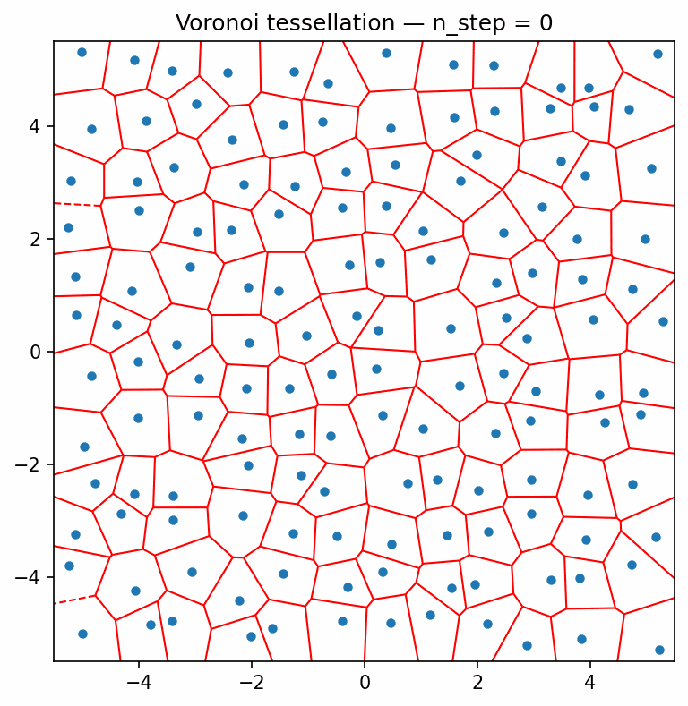

# Voronoi Tessellation Animation

This repository provides minimal examples for generating and visualizing 2D Voronoi tessellations.  
It includes both an automated animation script and a simple, interactive Jupyter notebook.



## Files

- **`generate_voronoi_plots.py`** — Generates a series of Voronoi diagrams with one moving point, renders frames in parallel, and assembles them into an animated GIF.
- **`Voronoi_tessellation.ipynb`** — Stand-alone notebook to plot a single Voronoi diagram for quick exploration.

## How to Use

1. (Optional) Create and activate a virtual environment:
   ```bash
   python -m venv .venv
   source .venv/bin/activate  # Windows: .venv\Scripts\activate
   ```

2. Install dependencies:
   ```bash
   pip install numpy scipy matplotlib imageio
   ```

3. Run the animation script:
   ```bash
   python generate_voronoi_plots.py
   ```

## Output

- PNG frames saved to `voronoi_frames/`
- `voronoi_animation.gif` created in the repository root

## Requirements

- Python 3.9+
- NumPy  
- SciPy  
- Matplotlib  
- ImageIO  

## Notes

- The animation script uses multiprocessing and a non-interactive Matplotlib backend for consistent frame generation.
- The notebook is self-contained and requires no additional files.
